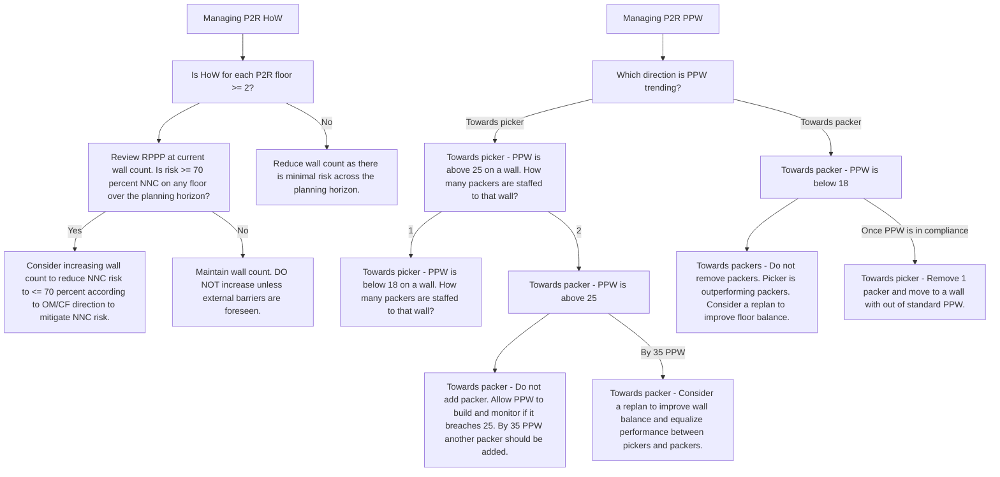

This flowchart covers the key decision points for managing P2R HoW and PPW based on the information provided. The symbols used are:

- Rectangles for process steps
- Diamonds for decision points
- Arrows to connect the steps

Let me know if you have any other questions or need further clarification on the flowchart.